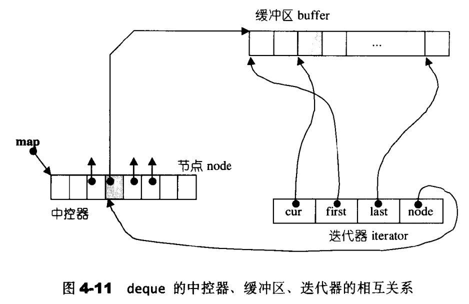
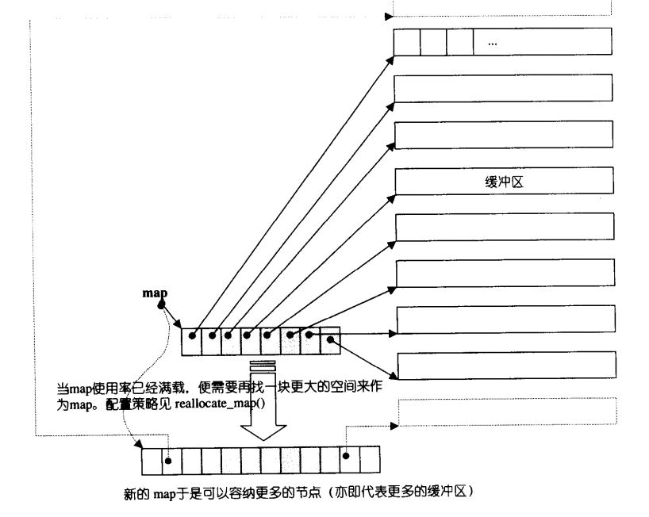
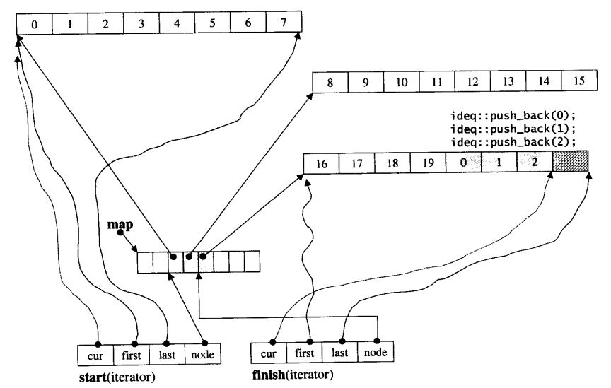

[TOC]

### 一、deque概述

#### 1、笔记整理原则

（1）尽量画很多图来加深对list数据结构和设计的理解，**一图胜千言**。

（2）不会详细讲解所有的代码，而是讲解**代码中的关键点，关键的数据结构和关键操作，并且对一些关键的边界条件进行讲解。**

（3）只讲解关键点，让你能完全hold住的关键点。

#### 2、deque简单介绍

（1）stl的deque本质上来说就是一个分段连续的容器，它支持动态扩充，并且支持从容器头和容器尾进行插入和移除元素。这个分段连续的容器实际对用户表现出来的特性就是连续的内存空间。

（2）deque分段连续的设计是由中控器和iterator联合实现的，首先，中控器作为一个数组，里面存放指向不同连续缓冲区的指针，每当需要插入一个新的元素的时候，deque判断当前的缓冲区是否有多余的空间，如果没有的话，创建一个新的缓冲区，并且把该指针加入中控区进行管理。同时iterator仿照指针的行为，重载相关的操作符，对内存中的deque组织的数据结构 进行操作。

（3）deque对外表现为连续的内存空间，那么它也支持随机存取的操作。

#### 3、deque主要数据结构和设计概述

deque有三种关键的设计，包括deque的中控器、iterator、和deque数据结构。



​	deque中控器的本质是一个数组，里面存放指向不同连续缓冲区空间的指针，缓冲区存放着用户需要存储的数据。

​	iterator主要有四个关键的对象，其中cur、first、last指向当前缓冲区的当前元素、第一个元素和最后一个元素，还有一个指向中控器的指针map，通过它可以清楚地了解到当前指向哪一个缓冲区；同时为了让用户使用deque的时候就想使用普通的连续空间一样，iterator类内还对相关的操作符进行重载：++/--/+=/-=/*/->等等。

​	deque比较关键的对象由两个iterator，start和finish用于表示第一个节点和最后一个节点、map指向中控器，它是一个里面存放了指向缓冲区的指针，不同的缓冲区为连续的内存空间，用来组织和存储用户的数据、map_size用来表示map里面有多少指针，就是有多少缓冲区的意思。

### 二、中控器和iterator

#### 1、中控器

​	deque的最大任务就是把分段连续的空间，配置为用户所看到的的连续的空间。deque使用的是一个中控区，该中控器是一个数组，它里面存放着的元素都是指向缓冲区的指针。其中模拟指针的操作主要由iterator实现，内存分配和数据增删查改等操作主要由deque实现，后面会详细叙述。



#### 2、iterator

​	deque是分段连续空间，为了维持它整体连续的假象，具体的任务落在了迭代器的身上。迭代器主要通过对操作符进行重载来实现。

​	deque迭代器应该具备以下一些结构设计，首先它应该知道当前的缓冲区（分段连续空间）在哪里；其次，它必须能判断自己是否处在缓冲区的边缘，如果是的话，那么 前进或者后退，必须能跨越缓冲区。为了能成功跨越缓冲区，它必须知道中控器在哪里。

以下是iterator的具体实现：

```
template <class T,class Ref,class Ptr, size_t BufSiz>
struct __deque_iterator
{
    typedef __deque_iterator<T,T&,T*,BufSiz> iterator;
    typedef __deque_iterator<T, const T&,const T*,BufSiz> const_iterator;

	static size_t buffer_size() {return __deque_buf_size(BufSiz,sizeof(T));}	//返回		buffer_size大小，可以用户自行设置
	typedef random_access_iterator_tag iterator_category;
	typedef T value_type;
	typedef Ptr pointer;
	typedef Ref reference;
    typedef size_t size_type;
	typedef ptrdiff_t difference_type;
	typedef T** map_pointer;
    typedef __deque_iterator self;

    T*cur;	//指向当前缓冲区当前元素
    T* first;	//指向当前缓冲区的第一个元素
    T* last;	//指向当前缓冲区的最后一个元素
	map_pointer node;	//指向管控中心
...
}
```

当迭代器在行进的时候遇到边界的时候，需要缓冲区节点，同时更新first和last

```cpp
void set_node(map_pointer new_node)
{
	node = new_node;
	first = *new_node;
	last = first + difference_type(buffer_size());
}
```

以下是关于操作符重载(所有的操作符操作的是对象)

```cpp
reference operator *() const {return *cur;}
pointer operator -> () const {return &(operator*());}	//不懂，需要细看
// 重载“-”，用于计算两个iterator之间的距离
difference_type operator-(const self &x) const{
    return difference_type(buffer_size() * (node - x.node -1) + (cur - first) + (x.last - x.cur));
}
self & operator ++()
{
    ++cur;
    if(cur == last)
    {
        set_node(node+1);
        cur = first;
    }
    return *this;
}
self operator ++（int）
{
	self tmp = *this;
	++*this;
	return tmp;
}
self & operator --()
{
    if(cur == first)
    {
        set_node(node -1);
        cur = last;
    }
    --cur;
    return *this;
}
self operator-- (int)
{
    self tmp = *this;
    --*this;
    return tmp;
}
// 迭代器可以跨越n个距离
self &operator +=(difference_type n)
{
    difference_type offse = n + (cur-first);	//计算跳跃之后，距离first的距离
    if(offset >= 0 && offset <differenct_type(buffer_size()))	//目标在同一缓冲区
        cur += n;
    else	//目标不在同一缓冲区
    {
        difference_type node_offset = 
            offset > 0 ? offset / difference_type(buffer_size()) :
        	-difference_type((-offset-1) / buffer_size()) -1;
        set_node(nod+node_offset);
        cur = first + (offset - node_offset *difference_type(buffer_size()));
    }
    return *this;
}
self operator+(difference_type n) const
{
    self tmp = *this;
    return tmp += n;
}
self& operator-=(difference_type n) const
{
    return *this += -n;
}
self operator- (difference_type n) const
{
    self tmp = *this;
    return tmp -= n;
}
reference operator[](difference_type n) const
{
    return *(*this + n);//这个好像有问题
}
bool operator == (const self &x) {return this->cur == x.cur}
bool operator != (const self &x) {return !(*this == x)}
bool operator < (const self &x) const
{
    return (node == x.node) ? (cur < x.cur) : (node < x.node);
}
```

### 三、deque的数据结构、构造与内存管理ctor/push_back/pop_back

#### 1、deque的数据结构

​	deque维护start和finish两个迭代器，分别指向第一个缓冲区的第一个元素和最后一个缓冲区的最后一个元素；并且有一个指向map的指针（指向中控区），同时它还需要知道当前map的大小，一旦map大小不够，它需要分配更大的map

```cpp
template <class T,class Alloc=alloc,size_t BufSiz = 0>
class deque
{
public:
	typedef T value_type;
	typedef value_type * pointer;
	typedef size_t size_type;
public:
	typedef __deque_iterator<T ,T&,T*,BufSiz> iterator;
protected:
	typedef pointer * map_pointer;
protected:
	iterator start;
    iterator finish;
    map_pointer map;
    size_type map_size;
   ...
  
public:
    iterator begin() {return start;}
    iterator end() {return finish;}
    reference operator[](size_type n)
    {
        return start[difference_type(n)];
    }
    reference front() {return *start}
    reference back()
    {
        iterator tmp = finish;
        --tmp;
        return *tmp;
    }
    size_type size() const {return finish - start;}
    size_type max_size() const {return size_tye(-1);}
    bool empty() const (return finish == start;)
}

```

#### 2、构造与内存管理ctor/push_back/pop_back

```
//deque构造函数
deque(int n, const value_type & value) : start() ,finish(),map(0),map_size(0)
{
    fill_initialize(n,value);
}
// fill_initialize负责构造deque结构，并且初始化元素初值
template <class T,class Alloc,size_t BufSize>
void deque<T,Alloc,BufSize>::fill_initialize(size_type n,const value_type& value)
{
    create_map_and_nodes(n);	//创建map和node结构
    map_pointer cur;
    __STL_TRY{
        for(cur = start.node; cur < finish.node; ++cur)
        	uninitialized_fill(*cur,*cur+buffer_size(),value);
        uninitialized_fill(finish.first,finish.cur,value);
    }
    catch(...)
    {...}
}
// create_map_and_nodes(n)产生deque结构
template<class T,class Alloc,size_t BufSize>
void deque<T,Alloc,BufSize>::create_map_and_nodes(size_type num_elements)
{
    size_type num_nodes = num_elements / buffer_size() + 1;
    map_size = max(initial_map_size() , num_nodes +2);
    map = map_allocator::allocate(map_size);
    map_pointer nstart = map + (map_size +num_nodes) / 2;
    map_pointer nfinish = nstart +num_nodes - 1;
    map_pointer cur;
    
    __STL_TRY
    {
        for(cur=nstart; cur < nfinish; ++cur)
        	*cur = allocate_Node();
    }
	catch(...){...}
	
	start.set_node(nstart);
	finish.set_node(nfinish);
	start.cur = start.first;
	finish.cur = finish.first + num_elements %buffer_siize();
}
```

​	接下来的范例为每个元素赋初值，并且在为尾部插入三个新的元素，并且画出此时的deque的状态图

```
for(int i=0; i< ideq.size(); ++i)
	ideq[i] = i;
for(int i=0;i<3;i++)
	ideq.push_back(i);
```



#### 3、相的测试程序在仓库的stl_test里面，里面涉及到所有容器的测试。

