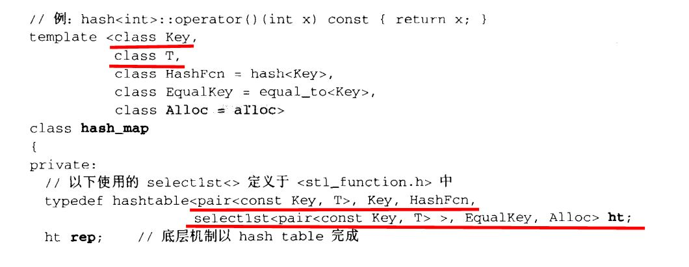
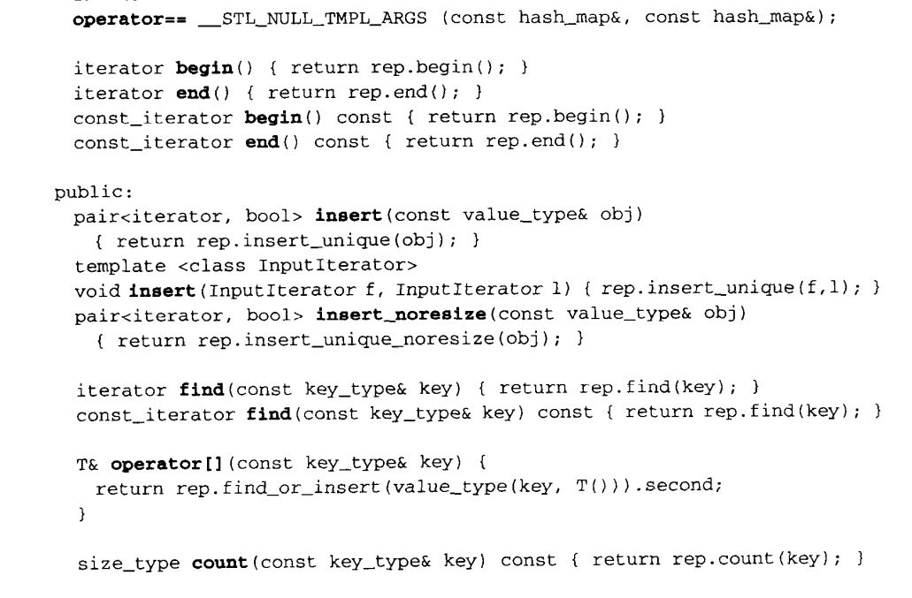
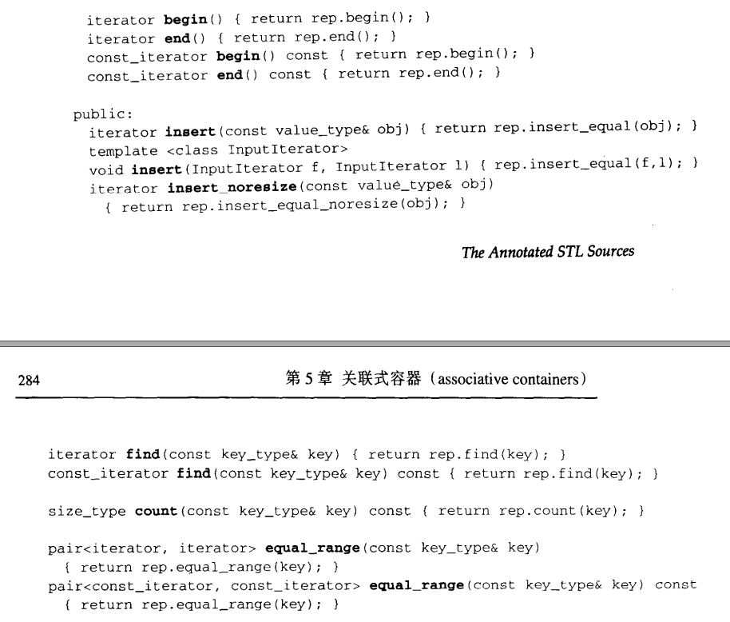

[TOC]

### 一、hash_map和hash_multimap概述

#### 1、笔记整理原则

（1）尽量画很多图来加深对list数据结构和设计的理解，**一图胜千言**。

（2）不会详细讲解所有的代码，而是讲解**代码中的关键点，关键的数据结构和关键操作，并且对一些关键的边界条件进行讲解。**

（3）只讲解关键点，让你能完全hold住的关键点。

#### 2、hash_map和hash_multimap简单介绍

（1）hash_map底层使用hashtable，同时map拥有key和value，他被整合成pair作为hashtable的元素传入hashtable，最终元素存放在哪个桶还是根据key值来定的。

（2）hashtable桶的个数每次以两倍进行扩充，一旦插入的元素个数大于桶的个数的时候，需要进行两倍扩充。所有的元素要根据新的通的个数和hashfunction进行重新插入，原来的iterator也不能用了。桶的实现使用vector进行实现。

（3）hash_multimap在hash_map的基础上可以插入key值相同的元素。

### 二、map关键源代码

### 三、multimap关键源代码

