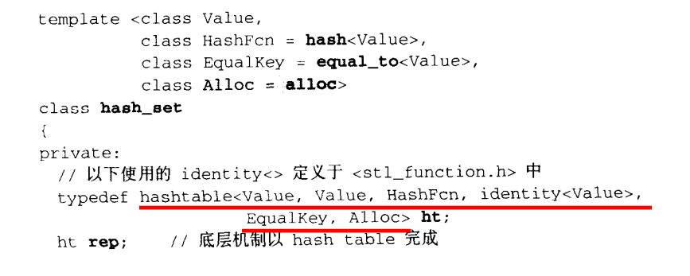
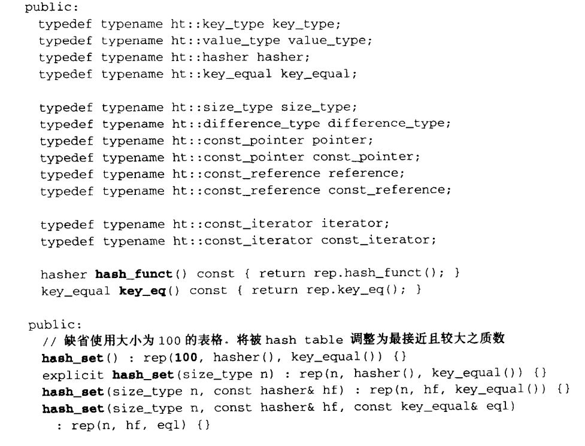
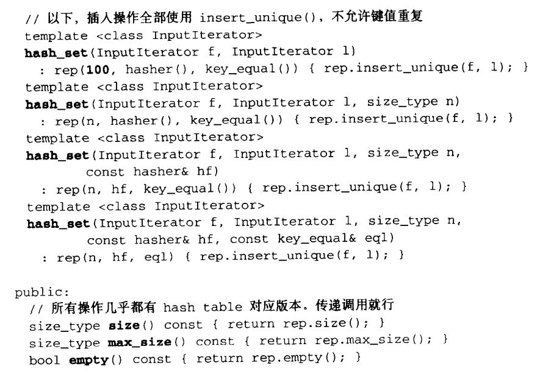
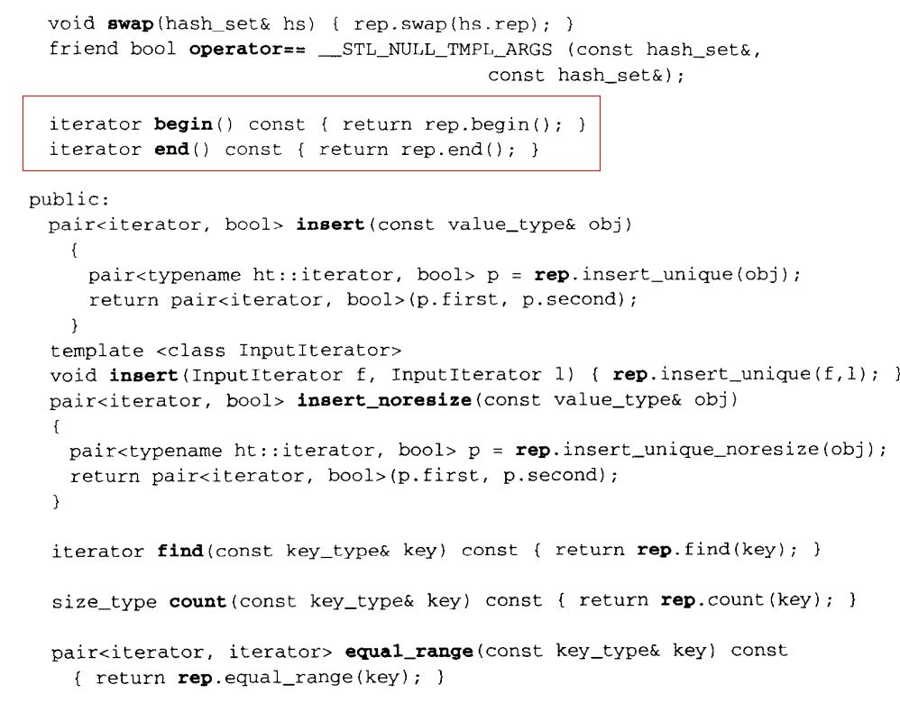
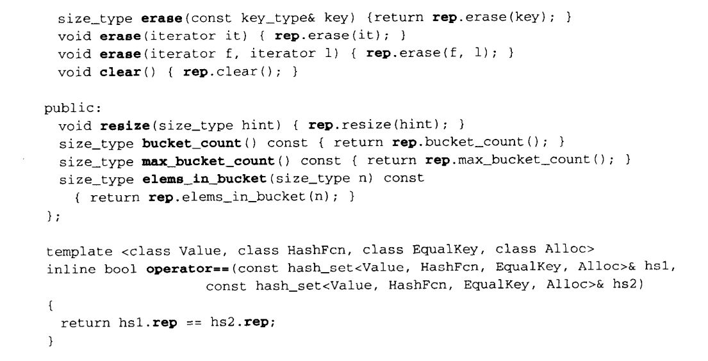
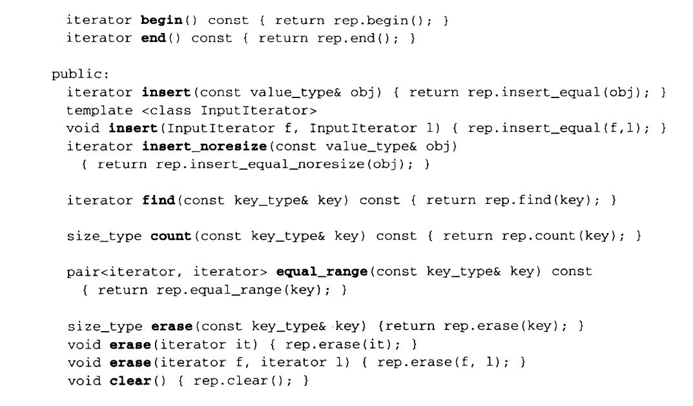

[TOC]

### 一、hash_set和hash_multiset概述

#### 1、笔记整理原则

（1）尽量画很多图来加深对list数据结构和设计的理解，**一图胜千言**。

（2）不会详细讲解所有的代码，而是讲解**代码中的关键点，关键的数据结构和关键操作，并且对一些关键的边界条件进行讲解。**

（3）只讲解关键点，让你能完全hold住的关键点。

#### 2、hash_set和hash_multiset简单介绍

（1）hash_set底层使用的是哈希表实现，所有的元素相关的操作都是通过哈希表变量来完成的。

（2）hash_set本质就是集合，只有键值，没有value值。hash_set不允许两个元素具有相同的键值。

（3）hash_multiset的特性与用法与set完全相同，唯一的差别是它允许键值重复。hash_multiset的底层也是用红黑树实现的。

### 二、set关键源代码

### 三、multiset关键源代码

hash_multiset其他的源代码跟hash_set差不多，底层也是声明了一个哈希表对象其中不同的是hash_multiset支持插入相同的key值的元素，它调用的是insert_equal()。

