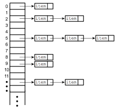
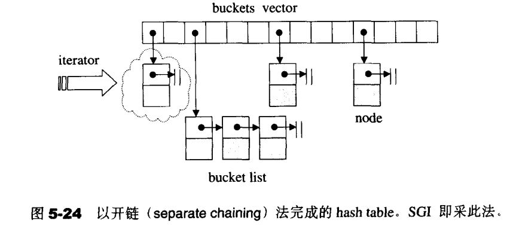

[TOC]

### 一、hashtable概述

#### 1、笔记整理原则

（1）尽量画很多图来加深对list数据结构和设计的理解，**一图胜千言**。

（2）不会详细讲解所有的代码，而是讲解**代码中的关键点，关键的数据结构和关键操作，并且对一些关键的边界条件进行讲解。**

（3）只讲解关键点，让你能完全hold住的关键点。

#### 2、hashtable简单介绍

（1）hashtable是一种典型的字典结构，也是一种二元结构（key,value），hashtable使用hash_function，当输入key的时候，可以找到对应value的内存存储下标。	hash_function(key) = index of value

（2）hashtable的插入、删除、修改、查询都是o(1)

（3）hash_function本质上是一种映射关系，它把元素的key值映射为对应的内存存储位置。

（4）对于不同的key值，输入到hash function之后，很有可能会出现冲突（就是可能对应相同的index值）。解决哈希冲突的办法有线性探测、二次探测和开链法。（线性探测和二次探测太简单，不做讨论）

（5）负载因子：元素个数 / 散列表长度，一般设计为小于1




​	**hashtable著名的应用场景：**

（1）字典树（[http://www.jianshu.com/p/40b55883aa41](https://www.jianshu.com/p/40b55883aa41)）

（2）分布式哈希

（3）一致性哈希

（4）hashset和hashmap底层用的也是hashtable

### 二、hashtable的桶子（buckets）与节点（nodes）

​	hashtable由buckets和nodes组成，其中buckets存放在容器vector里面。当通过hash function计算出来的index指的是对应的vector的bucket的下标，不同的key值计算出来相同的index的元素被封装为node节点之后，连接在bucket对应的node list上面。



node节点的组织结构是单链表形式

```cpp
template <class Value>
struct __hashtable_node
{
    __hashtable_node *next;
    Value val;
};
```

### 三、hashtable的迭代器

一下是hashtable迭代器定义：

```cpp
template <classs Value, class Key, class HashFcn, class ExtractKey, class EqualKey,lass Alloc>
struct __hashtable_iterator{
	typedef hashtable <Value,Key,HashFcn,ExtractKey,EqualKey,Alloc> hashtable;
	typedef __hashtable_iterator<Value,Key,HashFcn,ExtractKey,EqualKey,Alloc> iterator;
	typedef __hashtable_const_iterator<Value,Key,HashFcn,ExtractKey,EqualKey,Alloc> const_iterator;
	typedef __hashtable_node<Value> node;
	typedef forward_iterator_tag iterator_category;
	typedef Value value_type;
	typedef ptrdiff_t difference_type;
	typedef size_t size_type;
	typedef Value& reference;
	typedef Value* pointer;
	
	node *cur;	//迭代器当前指向的节点
	hashtable *ht;	//获取hash表的位置，有可能需要从一个bucket跳到另一个bucket
	__hashtable_iterator(node *n,hashtable *tab) :cur(n) , ht(tab){}
	__hashtable_iterator(){}
	reference operator*(){return cur->value;}
	pointer operator->(){return &(operator8())}
	iterator & operator++();
	iterator operator++(int);
	bool operator==(const iterator &it) {return cur == it.cur};
	bool operator != (const iterator &it) {return cur != it.cur};
};
```

​	hashtable iterator必须永远维系整个bucket vector的关系，同时记录当前的节点。节点的前进操作（没有后退）针对的是当前的cur指针，如果前进一个，那么指向node的next，如果是bucket下面的最后一个节点，那么就指向下一个bucket，同时更新cur。

```cpp
template <class V,class K,class HF, class Exk,class Eqk,class A>
__hashtable_iterator<V,K,HF,Exk,Eqk,A> &
__hashtable_iterator<V,K,HF,Exk,Eqk,A>::operator++()
{
    const node *old = cur;
    cur = cur->next;
    if(!cur)
    {
        size_type bucket = ht->bkt_num(old->value);
        while(!cur && ++bucket < ht->buckets.size())
        	cur = ht->buckets[bucket];
    }
    return *this;
}
```

```cpp
template <class V,class K,class HF, class Exk,class Eqk,class A>
inline __hashtable_iterator<V,K,HF,Exk,Eqk,A> 
__hashtable_iterator<V,K,HF,Exk,Eqk,A>::operator++(int)
{
    iterator tmp = *this;
    ++this;
    return tmp;
}
```

### 四、hashtable的数据结构

​	hashtable的bucket用vector进行存储，方便动态扩充

```cpp
template <classs Value, class Key, class HashFcn, class ExtractKey, class EqualKey,class Alloc = alloc>
class hashtable;	//声明

template <classs Value, class Key, class HashFcn, class ExtractKey, class EqualKey,class Alloc = alloc>
class hashtable{
public:
	typedef HashFcn hasher;
	typedef EqualKey key_equal;
	typedef size_t size_type;

private:
	hasher hash;
	key_equal equals;
	ExtractKey get_key;
	
	typedef __hashtable_node<Value> node;
	typedef simple_alloc<node,Alloc> node_allocator;
	
	vector<node *,Alloc> bucket;	//使用vector容器存储bucket
	size_type num_elements;
public:
	size_type bucket_count() const{return buckets.size();}
};
```

hashtable的模板参数类型说明：

Value：节点的实值类型

Key：节点的键值类型

HashFcn：hash function

ExtractKey：从节点中提取键值的方法（函数或者是仿函数）

EqualKey：判断键值相同与否的方法（函数或者仿函数）

### 五、hashtable的构造与内存管理

#### 1、创建新节点、释放节点、hashtable构造函数

```
//节点创建和释放函数
node *new_node(const value_type & obj)
{
    node *n = node_allocator::allocate();
    n->next = 0;
    __STL_TRY{
        construct(&n->value,obj);
        return n;
    }
    __STL_UNWIND(node_allocator::deallocate(n));
}
void delete_node(node *n)
{
    destroy(&n->value);
    node_allocator::deallocate(n);
}
```

构造函数

```cpp
hashtable(size_type n,const HashFcn& hf,const EqualKey& eql)
: hash(hf) , equals(eql),get_key(ExtractKey()) , num_elements(0)
{
    initialize_buckets(n);
}
void initialize_buckets(size_type n)
{
    const size_type n_buckes = next_size(n);	//hashtable装多少buckets，这里53
    buckets.reserve(n_buckets);
    buckets.insert(buckets.end(),n_buckets,(node*)0);	//全部初始化为0
    num_elements = 0;
}
```

#### 2、插入和表格重整（resize)

```cpp
// 不允许重复
pair<iterator,bool> insert_unique(const value_type &obj)
{
    resize(num_elements +1);	//表格重整，需要复制原先的node过去新的hash table
    return insert_unique_norsize(obj);
}

```

判断是否需要重建表格，如果不需要，立即返回

```cpp
template <class V,class K,class HF,class Ex,class Eq,class A>
void hashtable<V,K,HF,Ex,Eq,A>::resize(size_type num_elements_hint)
{
    //如果元素个数大于桶的个数，那么重整表格
    const size_type old_n = buckets.size();
    if(num_elements_hint >old_n)
    {
        const size_type n = next_size(num_elements_hint);	//找出下一个质数作为新的桶个数
        if(n > old_n)
        {
            vector<node*,A> tmp(n,(node*) 0);
            __STL_TRY
            {
                for(size_type bucket=0; bucket < old_n; ++bucket)
                {
                    node* first = buckets[bucket];
                    while(first)
                    {
                        //因为桶的个数增加了，原先的在同一个桶下面的node在新的hash table下面不一定
                        //在原来的bucket index位置，有可能是新位置，这里需要耗时
                    	//找出节点落在哪个新bucket
                        size_type new_bucket = bkt_num(first->val,n);
                        //buckets[bucket]用来临时存储first下一个节点，后面再返回给first，迭代下去
                        buckets[bucket] = first->next;
                        first->next = tmp[new_bucket];	//插入到List头部
                        tmp[new_bucket] = first;	//插入到list头部
                        first = buckets[bucket];	//迭代下去
                    }
                }
               	buckets.swap(tmp);	//新旧两个buckets对调
            }
        }
    }
}
```

在不需要重建表格的情况下插入新节点，键值不允许重复

```cpp
template <class V,class K,class HF,class Ex,class Eq,class A>
pair<typename hashtable<V,K,HF,Ex,Eq,A>>::iterator,bool>
hashtable<V,K,HF,Ex,Eq,A>::insert_unique_noresize(const value_type& obj)
{
    const size_type n = bkt_num(obj);	//决定obj应该位于哪一个bucket index
    node *first = buckets[n];
    
    for(node *cur = first;  cur; cur=cur->next)
        if(equals(get_key(cur->val),get_key(obj)))	//如果发现有键值相同的，直接返回失败
            return pair<iterator,bool>(iterator(cur,this),false);
    //如果bucket为空，插入新节点
    node *tmp = new_node(obj);
    tmp->next = first;
    buckets[n] = tmp;
    ++num_elements;	//节点个数加1
    return pair<iterator,bool> (iterator(tmp,this),true);
}
```

还有insert_equal和insert_equal_noresize函数，用来插入键值重复的节点，不再赘述

#### 3、判断元素的落脚处（bkt_num)

​	bkt_num调用的是hash function，它封装了一层。

```cpp
size_type bkt_num(const value_type& obj,size_t n) const
{
    return bkt_num_key(get_key(obj) , n)
}
// buk_num_key有多个版本
size_type bkt_num(const value_type& obj) const
{
    return bkt_num_key(get_key(obj));
}
size_type bkt_num_key(const key_type &key) const
{
    return bkt_num_key(key,buckets.size());
}
size_type bkt_num_key(const key_type& key, size_t n) const
{
    return hash(key) % n;
}
```

#### 4、clear() 、copy_from()

#### *5、hash function

<stl_hash_fun.h>定义有数个线程的hash function，全都是仿函数。针对char、int、long等整数类型，这里大部分的hash functions什么也没做，知识返回原值。

对于const char*，设计了一个转换函数：

```cpp
template <class Key> struct hash { };
inline size_t __stl_hash_string(const char* s)
{
    unsigned long h = 0;
    for(;*s;++s)
    {
        h = 5*h + *s;
    }
    return size_t(h);
}
```

