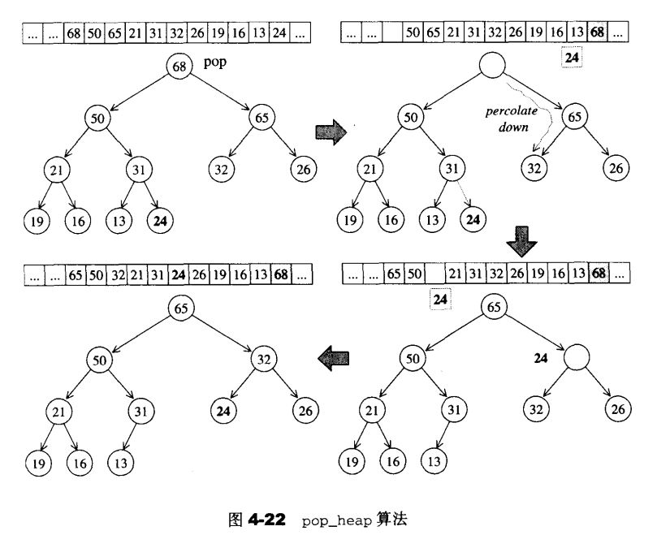

[TOC]

### 一、heap概述

#### 1、笔记整理原则

（1）尽量画很多图来加深对list数据结构和设计的理解，**一图胜千言**。

（2）不会详细讲解所有的代码，而是讲解**代码中的关键点，关键的数据结构和关键操作，并且对一些关键的边界条件进行讲解。**

（3）只讲解关键点，让你能完全hold住的关键点。

#### 2、heap简单介绍

（1）heap翻译过来的是堆的意思，具体的实现有大堆或者小堆，就是排序算法中对排序的一种辅助性的数据结构；stl里面的heap是作为priority queue的辅助性工具而存在的，priority queue通过max heap对元素进行存取，当priority queue拿元素的时候，就可以先拿优先级比较高的元素。

（2）所谓堆就是一种完全二叉树，它满足以下的性质：a、除了最后一层的叶子节点，其他节点都必须要有元素；b、最后一层的叶子节点从左到右不能有任何空隙。（下图就是一个完全二叉树）


（3）我们可以直接使用数组对完全二叉树进行存储，首先对完全二叉树进行编码，从根节点到叶子节点，按照从左向右的顺序进行编码。每个节点的编码存储在对应数组对应的编码下标。

（4）对于max_heap来说，要满足每个节点的数值都大于其子节点的数值，同时，根节点的数值是最大的。

### 二、heap算法

#### 1、push_heap

​	插入一个元素，首先把它插入到最后一个叶子节点。然后根据max_heap的规则，把它移动到合适的位置

（1）图示


（2）以下是push_heap实现代码

```cpp
template <class RandomAccessIterator>
inline void push_heap(RandomAccessIterator first, RandomAccessIterator last)
{
    __push_heap_aux(first,last,distance_type(first),value_type(first));
}

template <class RandomAccessIterator, class Distance, class T>
inline void __push_heap_aux(RandomAccessIterator first, RandomAccessIterator last,
                           Distance *,T *)
{
    __push_heap(first,Distance((last-first)-1),Distance(0),T(*(last-1)));
}

template <class RandomAccessIterator, class Distance, class T>
void __push_heap(RandomAccessIterator first, Distance holeIndex, Distance topIndex,T value)
{
    Distance parent = (holeIndex - 1) / 2;
    while( holeIndex > topIndex &&  *(first+parent) < value)	//往上追溯，这里的value是插入元素的值，就是end()
    {
        *(first + holeIndex) = *(first + parent);	//父值往下给
        holeIndex = parent;
        parent = (holeIndex - 1) / 2;
    }
	*(first + holeIndex) = value;
}
```

#### 2、pop_heap

​	pop_heap完成的主要功能是把max_heap的最大值，就是根节点给弹出来，然后再重新向下整理，重新把heap整理为max_heap

（1）图示（这里图示有问题，应该是移动完之后，把hole那个位置填上最后一个元素）



（2）代码

```cpp
template <class RandomAccesssIterator>
inline void pop_heap(RandomAccesssIterator first, RandomAccesssIterator last)
{
    __pop_heap_aux(first,last,value_type(first));
}
template<class RandomAccesssIterator, class T>
inline void __pop_heap_aux(RandomAccesssIterator first, RandomAccesssIterator last, T*)
{
    __pop_heap(first,last-1,last-1,T(*(last-1)),distance_type(first));
}
template <class RandomAccesssIterator, class T,class Distance>
inline void __pop_heap(RandomAccesssIterator first,RandomAccesssIterator last
RandomAccesssIterator result, T value, Distance *)
{
    *result = *first;
    __adust_heap(first,Distance(0),Distance(last-first),value);
}
template <class RandomAccesssIterator, class T,class Distance>
void __adust_heap(RandomAccesssIterator first, Distance holeIndex, Distance len ,T value)
{
	Distance topIndex = holeIndex;
    Distance secondChild = 2* holeIndex + 2;
    while(secondChild < len)
    {
        if(*(first+secondChild) < *(first+secondChild-1))
            secondChild--;
        //另较大值为洞值，并且把洞号移动到新的大节点处
        *(first+holeIndex) = *(first + secondChild);
        holeIndex = secondChild;
        secondChild = 2 * (secondChild + 1)
    }
    if(secondChild == len)	//如果没有右节点，如果有的话，应该是 == len-1
    {
        *(first + holeIndex) = *(first + secondChild - 1);
        holeIndex = secondChild - 1;
    }
    __push_heap(first,holeIndex,topIndex,value);	//最后一个插入value
}
```

#### 3、sort_heap

​	既然每次调用pop_heap都可以拿到键值最大的元素，那么可以持续对整个轮询做pop_heap，那么就可以拿到有序的元素，并且从大排到小

```cpp
template <class RandomAccesssIterator>
void sort_heap(RandomAccesssIterator first, RandomAccesssIterator last)
{
    while(last - first > 1)
    {
        pop_heap(first,last--);
    }
}
```

#### 4、make_heap

​	make_heap就是把现有的数据整理为一个heap

```cpp
template <class RandomAccesssIterator>
inline void make_heap(RandomAccesssIterator first, RandomAccesssIterator last)
{
    __make_heap(first,last value_type(first),distance_type(first));
}
template <class RandomAccesssIterator, class T, class Distance>
void __make_heap(RandomAccesssIterator first, RandomAccesssIterator last,
                T*,Distance *)
{
    if(last-fist < 2) return;
    Distance len = last - first;
    Distance parent = (len - 2) / 2;
    while(true)
    {
        __adust_heap(first,parent,len,T(*(first+parent)))
    	if(parent == 0)
            return;
        parent--;
    }
}
```


#### 4、heap没有迭代器

​	heap所有元素都是遵循完全二叉树进行排列的，并且直接用数组进行实现。所以heap不提供遍历功能，也不提供迭代器。

