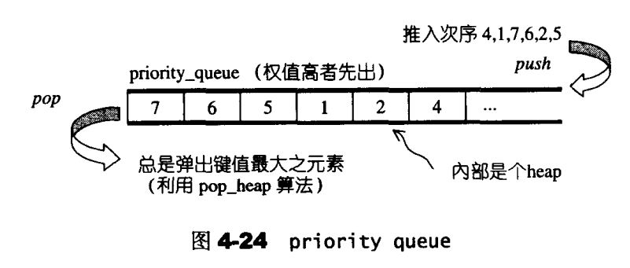

[TOC]

### 一、priority queue概述

#### 1、笔记整理原则

（1）尽量画很多图来加深对list数据结构和设计的理解，**一图胜千言**。

（2）不会详细讲解所有的代码，而是讲解**代码中的关键点，关键的数据结构和关键操作，并且对一些关键的边界条件进行讲解。**

（3）只讲解关键点，让你能完全hold住的关键点。

#### 2、priority queue简单介绍

（1）优先队列是这样一种容器，用户给每个元素一定的权值。然后把元素插入到容器中，容器根据元素的权值进行排列，当每次用户用容器中取出元素的时候，都是当前容器中优先值最大的元素。

（2）元素次序不是按照先后顺序进行排列，而是按照元素的权值自动进行排列，权值最高的排在最前面。

（3）优先队列的底层构造是使用max heap实现的，而max heap的本质就是一个大根堆（使用数组模拟完全二叉树，按照元素的权值进行元素的增删查改）



### 二、priority queue定义完整列表

#### 1、priority queue 定义完整列表

​	priority queue缺省的情况下，容器用vector，处理规则使用heap的处理规则，实现也非常简单。

​	queue以地步容器完成所有工作，这种“使用并且修改其他东西的接口，然后给用户提供新的接口和功能”的性质，称为适配器。所以priority queue一般不被称为容器，应该被归类为**容器适配器**。


```cpp
template <class T,class Sequence = vector<T>,class Compare = less<typename 
    Sequence::value_type>>
    
class priority_queue{
public:
    typedef typename Sequence::value_type value_type;
    typedef typename Sequence::size_type size_type;
    typedef typename Sequence::reference reference;
    typedef typename Sequence::const_reference const_reference;
protected:
    Sequence c;
    Compare comp;
public:
    priority_queue() : c() {}
    explicit priority_queue(const Compare &x) : c() , comp(x) {}
    
    template <class InputIterator>
    priority_queue(InputIterator first ,InputIterator last ,const Compare &x)
        : c(first,last),comp(x)
    {
    	make_heap(c.begin(),c.end(),comp);
    }
    template <class InputIterator>
    priority_queue(InputIterator first ,InputIterator last)
        : c(first,last)
    {
    	make_heap(c.begin(),c.end(),comp);
    }
    bool empty() const
    {
        return c.empty();
    }
    size_type size() const {return c.size()}
    const_reference top() const {return c.front()}
    void push(const value_type &x)
    {
        __STL_TRY{
            c.push_back(x);
            push_heap(c.begin(),c.end(),comp);
        }
    }
    void pop()
    {
        __STL_TRY{
            pop_heap(c.begin(),c.end(),comp);
            c.pop_back();
        }
    }
};
```

#### 2、priority queue没有迭代器

​	priority queue的元素进出和排列都有一定的规则，只有queue最顶端（权值最高）才能被用户去用。所以它不提供遍历功能，当然也不提供迭代器。

#### 3、测试实例

```cpp
#include<queue>
#include<iostream>
#include<algorithm>

using namespace std;

int main()
{
	int ia[9] = {0,1,2,41,5,62,35,2,31};
    priority_queue<int> ipq(ia,ia+9);
    cout << "size = " <<ipq.size() << endl;
    
    for(int i=0; i<ipq.size(); i++)
    	cout << ipq.top() << ' ';
    cout << endl;
    
    while(!ipq.empty())
    {
        cout << ipq.top() << ' ';
        ipq.pop();
    }
    cout <<endl;
}
```


