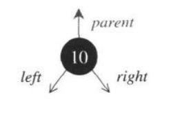
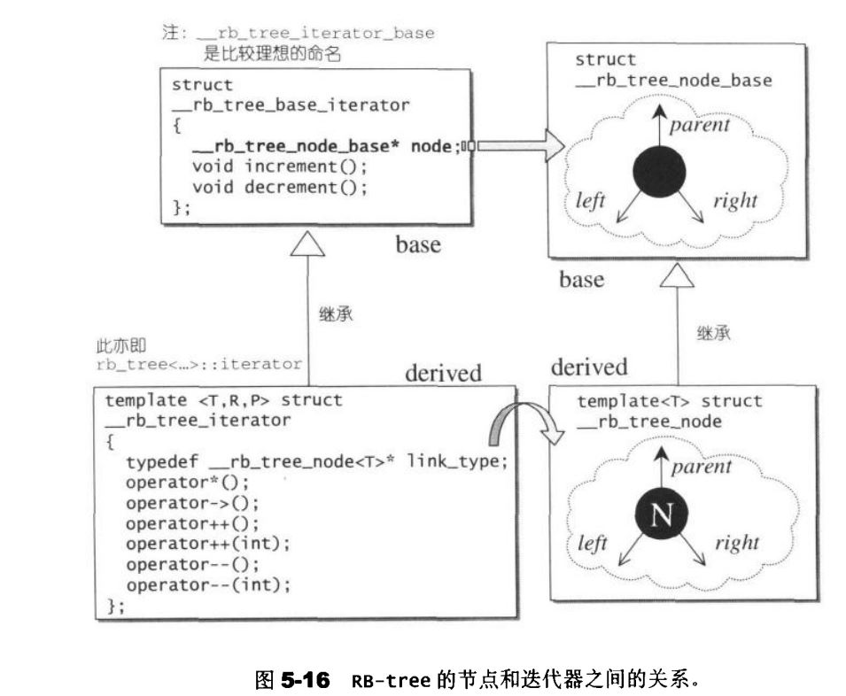
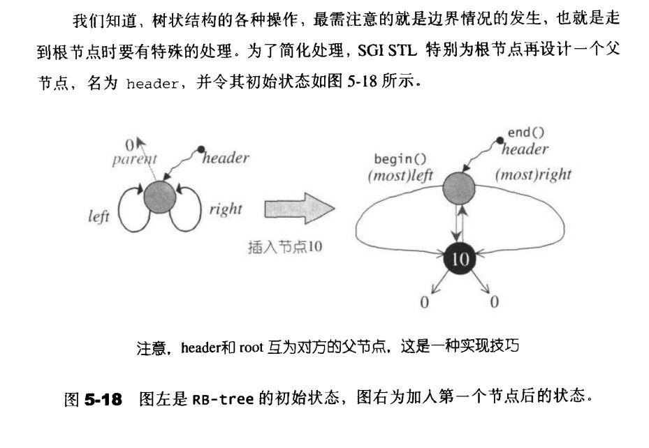

[TOC]

### 一、红黑树概述

#### 1、笔记整理原则

（1）尽量画很多图来加深对list数据结构和设计的理解，**一图胜千言**。

（2）不会详细讲解所有的代码，而是讲解**代码中的关键点，关键的数据结构和关键操作，并且对一些关键的边界条件进行讲解。**

（3）只讲解关键点，让你能完全hold住的关键点。

#### 2、红黑树简单介绍

​	红黑树的本质：先比于AVL，它使用非严格的平衡来换取增删节点时候需要旋转次数的降低，任何不平衡都能在3次旋转之内搞定。

​	首先来说，红黑树是一棵二叉搜索树。（满足二叉搜索树的性质：对于任意一个节点，该节点的左孩子节点的数值小于等于该节点，该节点的元素值小于等于右孩子节点的元素值）。同时，红黑树具有以下的规则：

（1）根节点必须为黑色节点

（2）叶子节点为空，并且必须为黑色节点

（3）某个节点如果是红色节点，那么它的孩子节点必须为黑色节点。

（4）任意节点到树尾端的叶子节点（NULL）的任何路径，所包含的黑色节点数必须相同。


​	**设计红黑树主要出于以下几点考虑：**

（1）首先，这是一棵比较平衡的二叉搜索树，比较平衡的意思就是说这棵树的高度是log(n)级别的（数的高度最多为2log(n)高度）方便进行元素的增删查改。（红黑树本质是一棵弱平衡二叉树）

（2）同时，红黑树因为一系列的着色规则，它没有平衡二叉树对高度限制那么严格，可能查找方面会稍稍比AVL慢一点，但相比于AVL，它们查找的效率都是log(n)级别的，只是前面的系数有区别。

（3）正因为它对树的平衡没有AVL限制得那么严格，所以，在节点删除、修改和增加方面，它相比于AVL需要更少的旋转操作，效率也高很多。

（4）正因为它出色的针对效率的设计，所以红黑树广泛应用于数据库中。

​	**红黑树常见的使用场景：**

（1）c++ stl的底层结构中，红黑树和哈希表是set 和map的底层结构

（2）着名的Linux的的进程调度完全公平调度程序，用红黑树管理进程控制块，进程的虚拟内存区域都存储在一颗红黑树上，每个虚拟地址区域都对应红黑树的一个节点，左指针指向相邻的地址虚拟存储区域，右指针指向相邻的高地址虚拟地址空间; 

（3）io多路复用的epoll的实现采用红黑树管理的sockfd，以支持快速的增删查改

（4）Nginx的的的中用红黑树管理定时器，因为红黑树是有序的，可以很快的得到距离当前最小的定时器;

（5）Java的的的中TreeMap中的中的实现


#### 3、红黑树与AVL的比较

​	红黑树的本质：先比于AVL，它使用非严格的平衡来换取增删节点时候需要旋转次数的降低，任何不平衡都能在3次旋转之内搞定。

​	红黑树的查询性能相比于AVL差一点点，但都是o(log n)数量级的；插入效率两者也差不多，都是o(1)；但是红黑树( o(1) )的删除操作明显优于AVL（o(log n)）。

|          | rb_tree                                                      | AVL                                                          |
| -------- | ------------------------------------------------------------ | ------------------------------------------------------------ |
| 平衡性   | 对于每个节点，左右子树的高度差绝对值小于等于1                | 节点遵循红黑着色规则，在最坏情况下，从根节点到叶子节点的最长路径为最短路径的两倍。 |
| 查找效率 | o(log (n))                                                   | o(log (n))                                                   |
| 删除效率 | o(log n) ：如果删除一个节点引起树的不平衡，最坏情况下，需要维护从被删除节点到root这条路径上的所有node的平衡性。 | o（1）：最多三次旋转                                         |
| 插入效率 | o（1）：如果插入一个节点导致树不平衡，至多需要两次旋转       | o（1）：如果插入一个节点导致树不平衡，至多需要两次旋转       |


#### 4、红黑树查找效率的数学证明

（1）定义BH(x)：x指红黑树的一个节点，BH(x)指这个x节点到叶子节点的路径上黑色节点的数量。根据上面的性质4，可以知道无论x走哪条路径到达叶子节点，BH(x)都一样。

（2）引理1：对于以节点x为根节点的子树，设子树的总的节点数量n，那么有$n ≥ 2^{BH(x)}−1$

要分2个情况来证明这个引理：

​	a.树只有黑色节点。此时根据性质4，可以知道这树是完全二叉树，完全二叉树的节点数量等于$2^h-1$，而h又等于BH(x) 。所以此种情况满足引理。

​	b.树有黑色也有红色节点。可以把这种情况视作第一种情况下的红黑树被添加了一些红色节点或者黑色节点被替换成红色节点，根据性质1-4，可知道红色节点只会导致BH(x)值不变或变小。不等式依然成立。

（3）引理2：设树的高度为h，那么有$BH(root) >= \frac{h}{2}$

​	因为红黑树的性质3“红节点的2个孩子都是黑节点”，所以使得一条路径上红节点总数最大化的方法，必然是“黑(root)-红-黑-红-······-黑-红-黑-红-黑(leaf)”，注意，最后一个必然是叶子节点，根据性质2，这个叶子节点是黑节点，所以根据这个路径排列，就可以知道红节点必然比黑节点少，反而言之，黑节点数量必然大于等于高度的二分之一。

**引出定理：任意一棵红黑树必然满足：$h≤2log_2(n+1)​$**


### 二、红黑树的增删查改

#### 1、旋转操作

以右旋转为例：例如右旋节点M步骤（左旋转也是类似）

（1）将节点 M 的左孩子引用指向节点 E 的右孩子

（2）将节点 E 的右孩子引用指向节点 M，完成旋转


#### 2、插入操作

​	插入的主要流程：首先找到插入位置，然后插入一个红色节点。然后对红黑树进行变色和旋转，让新的红黑树满足4个基本的性质。插入操作主要有以下四种情况：

（1）插入节点为根节点或者是其父节点为黑色


（2）父节点和叔叔节点是红色

N 的父节点是红色（节点 P 为红色，其父节点必然为黑色），叔叔节点 U 也是红色。由于 P 和 N 均为红色，所有性质4被打破，此时需要进行调整。这种情况下，先将 P 和 U 的颜色染成黑色，再将 G 的颜色染成红色。此时经过 G 的路径上的黑色节点数量不变，性质5仍然满足。但需要注意的是 G 被染成红色后，可能会和它的父节点形成连续的红色节点，此时需要递归向上调整。


（3）父节点是红色，叔叔是黑色

当插入N节点是右孩子的时候，此时先对节点 P 进行左旋，调整 N 与 P 的位置。接下来按照左孩子节点进行处理，以恢复性质4。


当插入的节点是左孩子节点：


**插入总结：**

​	第一种情况比较简单。第二种和第三种比较麻烦，但也有规律。就是，如果插入节点的父节点和叔叔节点是红色，那么直接把爸爸和叔叔变色；如果爸爸是红，叔叔是黑，并且插入到左孩子，那么直接右旋转，然后变色；如果如果爸爸是红，叔叔是黑，并且插入到右孩子，那么直接左旋转，然后按照左孩子处理。


#### 3、删除操作

​	我们先做一些假设，方便说明。这里假设最终被删除的节点为`X`（至多只有一个孩子节点），其孩子节点为`N`，`X`的兄弟节点为`S`，`S`的左节点为 SL，右节点为 SR。接下来讨论是建立在节点 `X` 被删除，节点 `N` 替换`X`的基础上进行的。这里说明把被删除的节点`X`特地拎出来说一下的原因是防止大家误以为节点`N`会被删除，不然后面就会看不明白。


如果被删除节点为红色，直接将用子节点替换之，这种情况很简单，当被删除节点为黑色的时候，情况如下（假设替代被删除位置的节点为N，其父亲为P，其兄弟为S，兄弟左儿子为SL，兄弟右儿子为SR）：


总述：虽然删除情况较多，但是实际上总的可以分为两种情况，SL,SR全为黑和SL,SR至少有一个为红。
a.  SL,SR 全为黑，分为三种情况，P红S红不存在，不符合红黑树定义

```
 1) N黑，P黑，S红，通过处理变为3),4),5)
 2) N黑，P黑，S黑，通过将S变为红，将P设置给N，递归向上进行处理
 3) N黑，P红，S黑，交换P和S的颜色，满足红黑树，处理完毕
```

下面两个属于SL和SR至少有一个为红的情况
b. SL红，SR黑，此时S必为黑，P无所谓颜色

```
4) 经过处理，以S为中心进行右旋，变为5)
```

c. SL无所谓颜色，SR红，此时S必为黑，P无所谓颜色

```
5) P的颜色给S，SR变为黑，然后以P为中心进行左旋，红黑树处理完毕
```


### 三、rb_tree节点设计

​	每个rb_tree节点主要有五个元素：颜色、节点值、指向父节点指针、指向左孩子指针、指向右孩子指针。



```cpp
typedef bool __rb_tree_color_type;
const __rb_tree_ccolor_type __rb_tree_red = false;
const __rb_tree_ccolor_type __rb_tree_black = true;

struct __rb_tree_node_base
{
    typedef __rb_tree_color_type color_type;
    typedef __rb_tree_node_base * base_ptr;
    color_type color;
    base_ptr parent;	//指向父节点
    base_ptr left;	//左孩子
    base_ptr right;	//右孩子

	static base_ptr minimum(base_ptr x)
	{
    	while(x->left != 0)
        	x = x->left;
    	return x;
	}
    static base_ptr maximum(base_ptr x)
    {
        while(x->right != 0)
            x = x->right;
        return x;
    }
};
template<class Value>
struct __rb_tree_node : public __rb_tree_node_base
{
	typedef __rb_tree_node<Value> * link_type;
	Value value_fielf;	//节点值
};
```

### 四、rb_tree迭代器

​	rb_tree迭代器属于双向迭代器，但不支持随机定位的能力，其操作与list十分相似。rb_tree的前进操作operator++()调用的是几层迭代器的increment()，rb_tree的后退操作operator--()调用的是基层迭代器的decrement()。

​	前进和后退操作完全依据二叉搜索树的节点排列法则。



```cpp
struct __rb_tree_base_iterator
{
    typedef __rb_tree_node_base::base_ptr base_ptr;	//rb_tree node typedef
    typedef bidirectional_iterator_tag iterator_category;
    typedef ptrdiff_t difference_type;
    base_tpr node;	//rb tree node ptr
    
    //寻找找出下一个节点位置，按照从小到大排列大的顺序（分情况进行讨论）
    void increment()
    {
        if(node->right !=0)
        {
            node = node->right;
            while(node->left ! 0)
                node = node->left;
        }
        else
        {
            base_ptr y = node->parent;
            while(node == y->ptr)
            {
                node = y;
            }
        }
    }
    void decrement()
    {
        //如果是红色节点，并且父节点的父节点等于自己
        //头结点
        if(node->color == __rb_trree_red &&node->parent->parent == node)
            node = node->right;
        else if(node->left != 0)
        {
            base_ptr y = node->left;
            while(y->right != 0)
                y = y->right;
            node = y;
        }
        else
        {
            base_ptr y = node->parent;
            while(node == y->left)	//一直往上走，如果自己是父母的左孩子
            {
                node = y;
                y = y->parent;
            }
            node = y;
        }
    }
}
```

rb_tree正规迭代器

```cpp
template <class Value, class Ref,class Ptr>
struct __rb_tree_iterator  : public __rb_tree_base_iterator
{
	typedef Value value_type;
	typedef Ref reference;
	typedef Ptr pointer;
	typedef __rb_tree_iterator<Value,Value&,Value*> iterator;
    typedef __rb_tree_iterator<Value,const Vallue&,const Value*> const_iterator;
    typedef __rb_tree_iterator<Value,Ref,Ptr> self;
    typedef __rb_tree_node<Value> * link_type;
    
    __rb_tree_iterator() {}
    __rb_tree_iterator(link_type x) {node = x;}
    __rb_tree_iterator（const iterator& it) {node = it.node}
    
    reference operator*() const {return link_type(node)->value_field}
    #ifndef __SGI_STL_NO_ARROW_OPERATOR
    	pointer operator->() cosnt { return &(operator*());}
    #endif
    
    self& operator++() {inccrement(); return *this;}
    self& operator++(int) {
    	self tmp = *this;
    	++this;
    	return tmp;
    }
    self& operator--() {decrement(); return *this;}
    self& operator--(int) {
    	self tmp = *this;
    	--this;
    	return tmp;
    }
}
```


### 五、rb_tree数据结构

​	rb_tree的定义类里面包括了专属的空间配置器，每次用来配置一个节点的大小；还有各种类型定义，用来维护整棵树的三笔数据，以及一些函数的定义和声明

```cpp
template<class Key, class Value, class KeyOfValue,class Compare,class Alloc = alloc>
class rb_tree
{
protected:
    typedef void* void_pointer;
    typedef __rb_tree_node_base* base_ptr;
    typedef __rb_tree_node<Value> rb_tree_node;
    typedef simple_alloc<rb_tree_node,Alloc> rb_tree_node_allocator;
    typedef __rb_tree_color_type color_type;

public:
    typedef Key key_type;
    typedef Value value_type;
    typedef value_type* pointer;
    typedef const value_type* const_pointer;
    typedef value_type& reference;
    typedef rb_tree_node* link_type;	// rb_tree_node pointer
    typedef ptrdiff_t difference_type;
protected:
    link_type get_node() {return rb_tree_node_allocator::allocate();}
    void put_node(link_type p) {rb_tree_node_allocator::deallocate(p);}
    
    link_type create_node(const value_type& x)
    {
        link_tye tmp = get_node();
        __STL_TRY
        {
            construct(&tmp->value_field,x);
        }
        __STL_UNWIND(put_node(tmp));
        return tmp;
    }
    link_type clone_node(linktype x)
    {
        link_type tmp = create_node(x->value_field);
        tmp->color = x->color;
        tmp->left = 0;
        tmp->right = 0;
        return tmp;
    }
    void destroy_node(link_type p)
    {
        destroy(&p->value_field);
        put_node(p);
    }

protected:
    size_type node_count;	//树的节点个数
    link_type header;	//实现上的一个技巧，这个相当于是树的头结点
    Compare key_compare;	//节点间键值比较
    
    link_type& root() const {return (link_type&) header->parent;}
    link_type& leftmost() const {return (link_type&) header->left;}
    link_type& rightmost() const {return (link_type&) header->right;}
    
    //以下6个函数用来方便取得节点x的成员
    static link_type& left(link_type x);
    static link_type& right(link_type x);
    static link_type& parent(link_type x);
    static link_type& value(link_type x);
    static const Key& key(link_type x)
    {
        return KeyOfValue()(value(x));
    }
    static color_type& color(link_type x);
}

public:
	typedef __rb_tree_iterator<value_type,reference,pointer> iterator;
private:
	iterator __insert(base_ptr x,base_ptr y, const value_type &v);
	link_type __copy(link_type x,link_type p);
	void __erase(link_type x);
	void init()
    {
        header = get_node();	//产生一个头结点
        color(header) = __rb_tree_red;
        root() = 0;
        leftmost() = header;
        rightmost() = header;
    }
public:
	rb_tree(const Compare& comp = Compare()) : node_count(0),key_compare(comp)
    {
        init();
    }
	~rb_tree()
    {
        clear();
        put_node(header);
    }
	rb_tree<Key,Value,KeyofValue,Compare,Alloc>&
        operator=(const rb_tree<Key,Value,KeyofValue,Compare,Alloc>&x);
public:
	Compare key_comp() const {return key_compare;}
	iterator begin() {return leftmost();}	//返回rb_tree最小值节点
	iterator end() {return header;}	//rb tree终止节点为header指向处
	bool empty() const {return node_count == 0;}
	size_type size() const {return node_count;}
	size_type max_size() const {return size_type(-1);}
public:
	pair<iterator,bool> insert_unique(const value_type&x);	//插入节点到rb_tree,节点值独一无二
	iterator insert_equal(const value_type& x);	//插入节点，不允许重复
};
```


### 六、rb_tree构造与内存管理



​	接下来每插入一个新节点，要保持header的重要性，headr的左孩子节点指向最小节点，右孩子节点指向最大节点。

### 七、rb_tree元素操作

​	rb_tree的元素操作重点只讲一下插入和搜索，rb_tree提供两者中插入操作：insert_unique()和insert_equal()操作，前者表示插入的节点值在红黑树中必须独一无二，后者可以插入相同的节点值。

```cpp
template<class Key, class Value, class KeyOfValue,class Compare,class Alloc>
typename rb_tree<Key,Value,KeyofValue,Compare,Alloc>::iterator
rb_tree<Key,Value,KeyofValue,Compare,Alloc>::insert_equal(const Value& v)
{
    link_type y = header;
    link_type x = root();
    while(x != 0)
    {
        y = x;
        x = key_compare(KeyOfValue()(v),key(x)) ? left(x) : right(x);
    }
    return __insert(x,y,v);	//x为心智插入点，y为父节点，v为新值
}
```

未完待续。。。

### 八、参考博客

https://segmentfault.com/a/1190000012728513