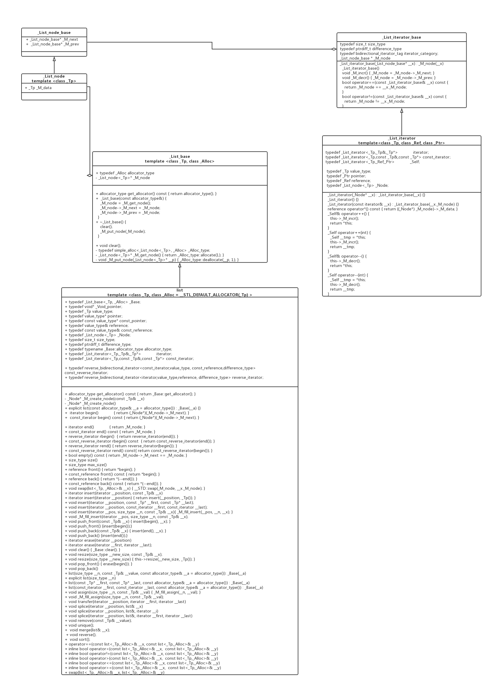

### 一、list的主要数据结构概述

​        stl的list容器底层使用双向链表的形式来存储用户需要存储的各种数据，这些数据可以是c++已有的数据类型，例如int、double、float等等，也可以是用户使用struct自定义结构的数据。这种可以让用户自行选择需要处理或者存储的数据结构，主要使用了c++ 的template。

​        list里面主要有三种主要的类设计，包括list_node、list_iterator和list。

​	list_node主要用来把用户传进来的数据，在内存中组织成双向链表的结构；

​	list_iterator（迭代器）里面包含了一个指向list_node节点的指针和一大堆的操作符重载，例如前++、后++、前--、后--、指针操作符->、*、==、!=所有涉及到指针的操作，它都进行重载。它的设计初衷就是设计成类似指针的操作，所有对list_iterator的对象操作符操作，都转化为类内对list_node指针的操作。例如获取节点数据（用户存储的数据）、指针++等等。

​	list里面包括了一个list_node的指针，还有对list_node的一系列操作，包括节点插入、begin（获取初始节点的iterator）、end（获取结束节点的iterator）、rbegin、rend、swap等等，本质的思想也都是透过list_node指针，内存中的list_node组织的数据进行操作。其中，m_node -> next指向begin节点，m_node指向end节点。

### 二、list_node、list_iterator和list本身的主要设计

