[TOC]

### 前言

#### 1、看源码的几个要点

### 2、

### 一、stl为什么使用内存管理

1、速度

2、节省内存（从malloc的角度）

3、写成统一的标准接口，供不同的容器使用

### 二、stl内存管理图解

代码版本：GNU2.9

分配器名字: alloc

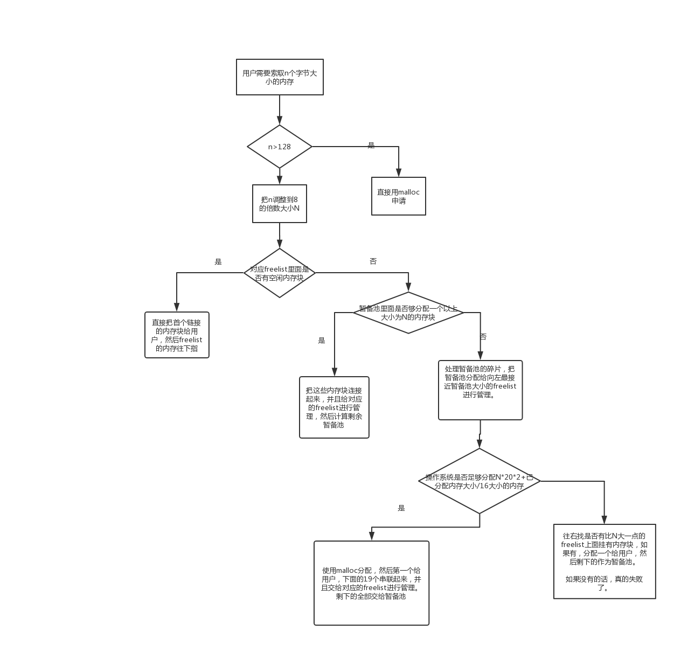

#### 1、内存分配总图

​	对于小于128个字节的内存块（8-128字节，共16种内存块大小），stl的alloc类使用一个freelist的数组进行管理。首先，把用户需要申请的内存（这里的用户指的是容器）按照8的倍数进行对齐（例如用户分配7个字节，那么就主动给它分配8个字节的内存块。）

​	然后一次性分配一块大内存块（内存大小 = 用户需要的大小 * 20 * 2 + 所有分配的历史内存总量 / 16），然后把这块大块内存里面的前20块小内存用链表的方式连接起来，把第一块的内存返回给用户进行使用，剩余的内存使用start_free和end_free进行标记为备用池。

​	下一次用户拿内存的时候，先看对应的申请内存大小的freelist里面是不是有多余的内存块，如果有的话，直接返回给用户进行使用，freelist指向下一个指针；

​	如果没有的话，看当前备用池的大小是否够分配20个大小的内存块，如果够的话，就把备用池里面的20块内存供给分配器进行链接，然后把第一块内存给到用户；

​	如果当前备用池的大小不够20倍用户需要分配的内存块，但是大于一块内存块的大小，那么计算一下备用池是用户需要分配内存的大小的多少倍，然后同样链接到对应的freelist上面。

​	如果备用池不够当前用户申请块的大小，但是大于8个字节，那么就向前找可以链接到哪个freelist对应的index下面。同时反复上面的方法，一次性分配大块内存再链接，把第一块内存给用户进行使用。

​	如果系统内存的大小不够需要系统分配的内存大小，那么就向右开始找第一个有多余内存内存块链表，然后取下一块来给他用，同时对应的那个freelist的指针往下移动。

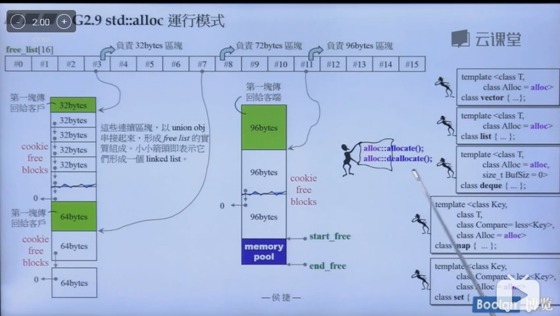

​	一开始freelist里面的所有指针都为0，就是空。

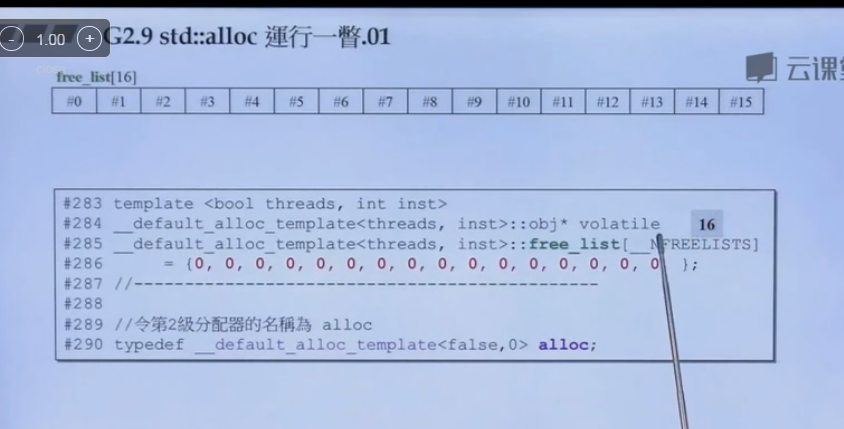

​	

​	用户向内存分配器索求32个字节大小的内存空间，分配器看了看当前freelist数组index3对应位置是否指向为空，如果为空，并且当前暂备池没有多余的内存可以分配，所以直接向操作系统申请 32 * 20 * 2 + 已分配内存 / 16大小的内存，然后从中切出一块来给用户，接下来的19个用链表连接起来。还有余下的所有分配的内存作为暂备池（大小为640个字节）

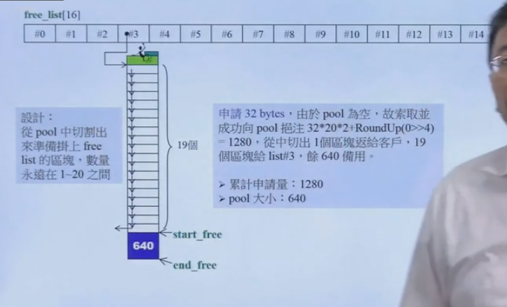

​	下一次用户需要64个字节大小的内存块，分配器先看一下index=7的位置有没有连接内存块。此时上面没有挂载内存块，然后查看一下暂备池的大小，此时刚好可以用来存储9个内存块。那么就把第一个给用户，然后剩余的用链表的方式挂载在index=7的freelist上面。

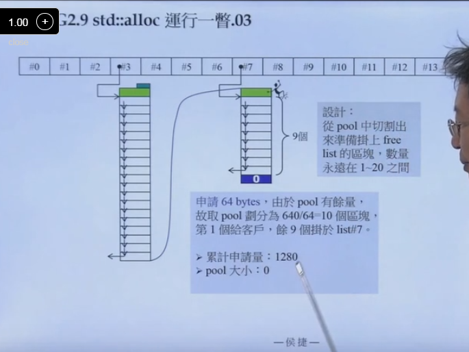

​	然后用户要申请88的内存大小空间，此时暂备池也没有空间，对应的index=11也没有挂载内存。那么就仿效上面的办法申请88 * 20 * 2 + 已分配的内存/16 内存大小的内存。最后的暂备池大小是2000。

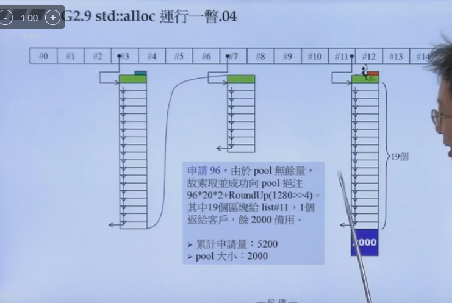

​	

​	同上，先看暂备池有没有东西，有的话就从里面分配。

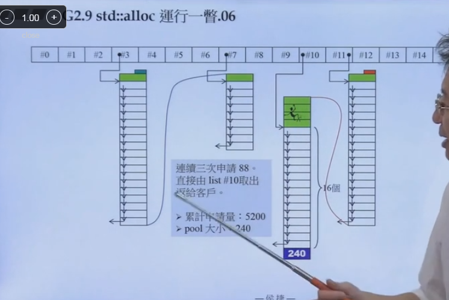

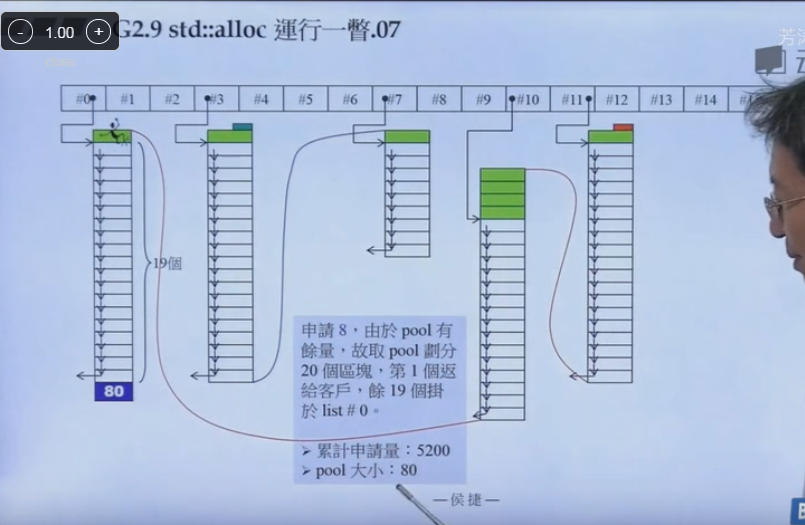

​	分配104，此时暂备池只有80，不够分配一个内存块。此时要先把内存碎片进行处理，往前看看刚好可以分配给一个index=9的内存块，把这个内存块挂接过去。

​	然后再给104分配104* 20 *2 + 已分配内存/16大小的内存，同上一个给用户，另一个19个链接起来，并且挂载在index=9的freelist下面。最后剩余的作为暂备池。

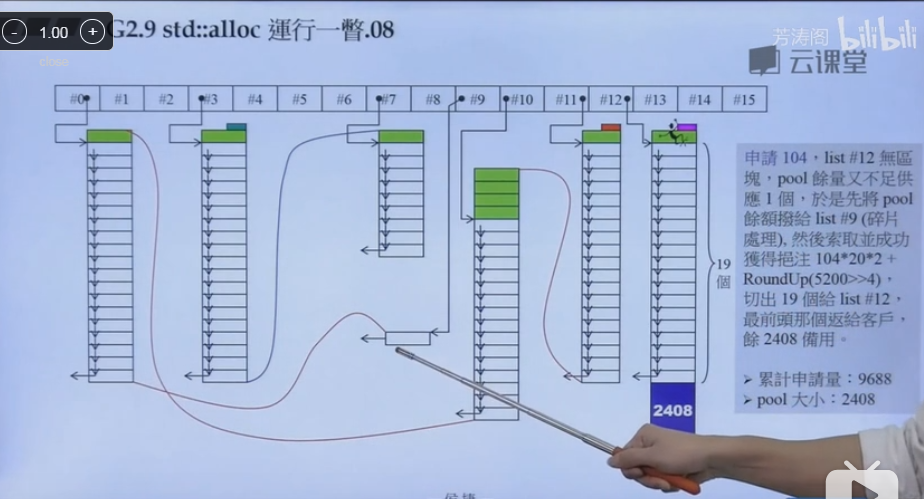

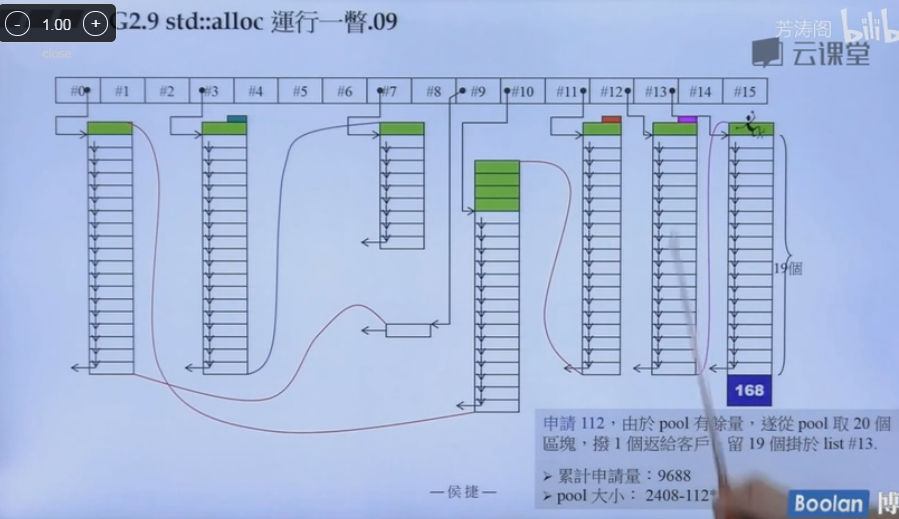

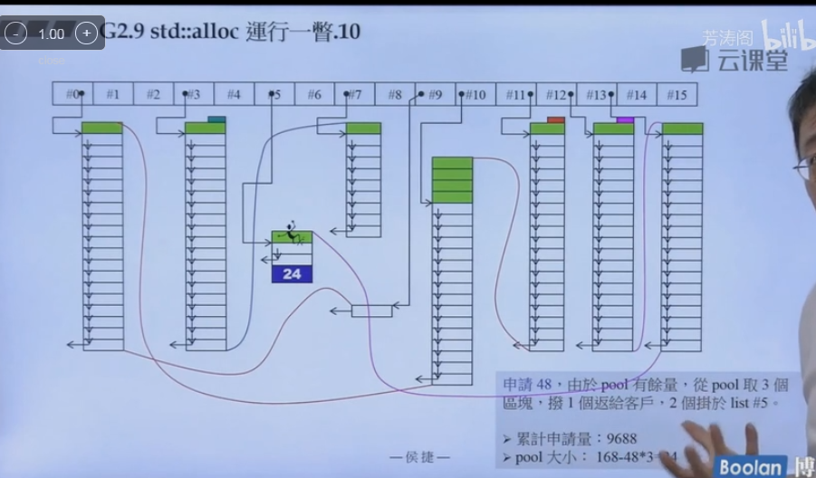

​	此时暂备池不足供应1个，并且无可用区块，先按照之前的方法处理暂备池碎片。然后再索取内存，发现当前内存空间不够。此时，可以往右看看最接近72大小的内存块（80 list9），从里面切割一块出来给72给用户，剩下的给暂备池。

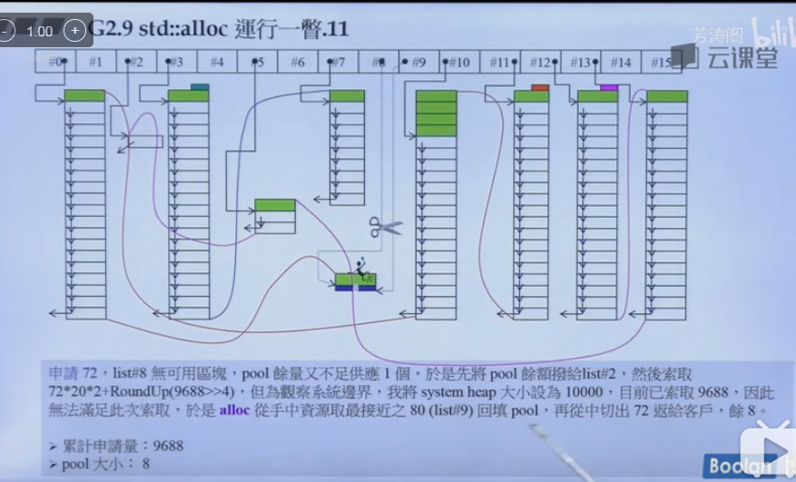

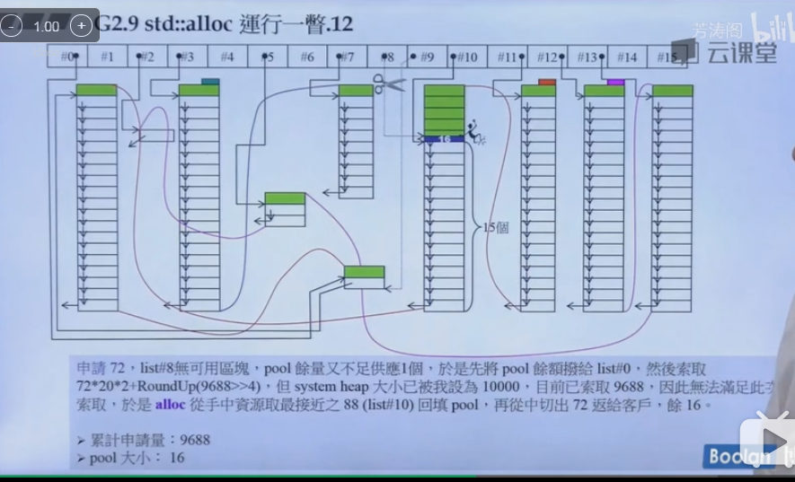

​	申请120，暂备池不够，先处理暂备池碎片。然后向系统索取内存，发现失败，于是向右找最接近需要分配内存大小的内存块，发现没有，此时穷途末路，分配失败。于是要调用内存释放回调函数释放一些内存再做处理。

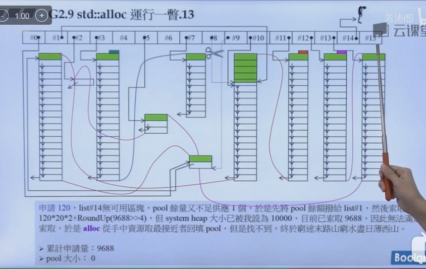

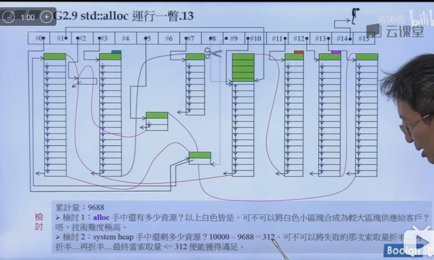

### 三、stl关键代码详解

#### 1、allocate函数

​	allocate函数的作用是分配bytes个字节的内存块给用户，并且返回内存块的指针给用户使用。

​	allocate的流程很简单，先看用户分配的内存是不是大于128个字节，如果是的话直接用malloc分配。如果不是的话，看对应的是freelist哪个index，然后查看freelist里面挂载的第一个内存是不是为空，如果不为空，直接分配，然后返回，如果为空，调用refill分配内存，并且返回指针。

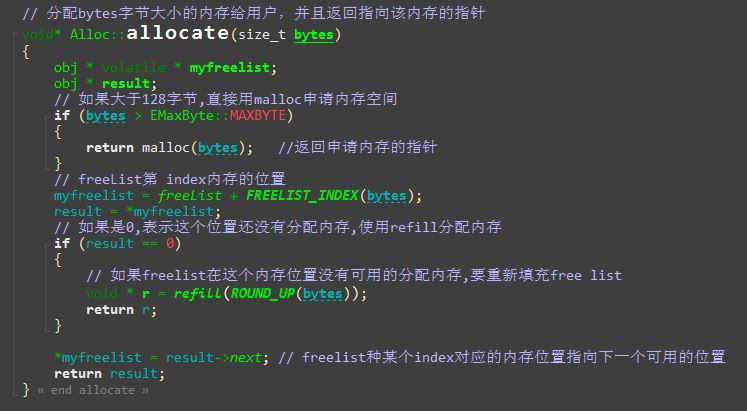

#### 2、 refill函数

​	refill调用chunkAlloc来分配内存（从暂备池或者malloc），chunkAlloc的第二个参数是reference，这个细节说明了nobjs是可以在函数里面改变大小的，因为如果是暂备池的话，分配的大小可能不足20个。

​	然后找到n对应的freelist的index位置myfreelist，然后把myfreelist里面填入第二个元素，因为第一个分配给用户并且最后返回了。然后用for循环把nobjs个内存块全部连接起来。

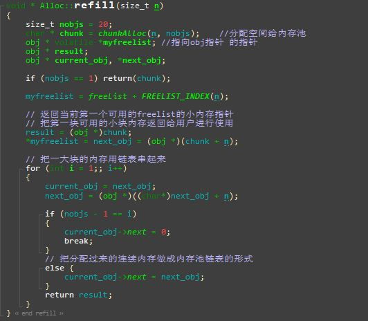

#### 3、chunAlloc函数

计算总的需要分配的大小

（1）如果暂备池够的话，直接从暂备池分配，并且更新暂备池的空间位置。

（2）如果不够分配20个，但是可以分配一个以上，那么有多少个就分配多少个，然后更新nobjs，暂备池剩余大小并且返回内存指针。

（3）如果不够一个的话，有点g

先看暂备池能往前分配给哪个freelist并且挂载下来（处理暂备池碎片）

然后，调用malloc分配 n * 20 * 2  + 总分配大小 / 16的内存大小。

​	如果分配成功，计算暂备池，然后重新调用chunkAlloc进行分配。

​	如果分配不成功，向右看有没有最接近分配给暂备池，然后调用chunkAlloc分配。

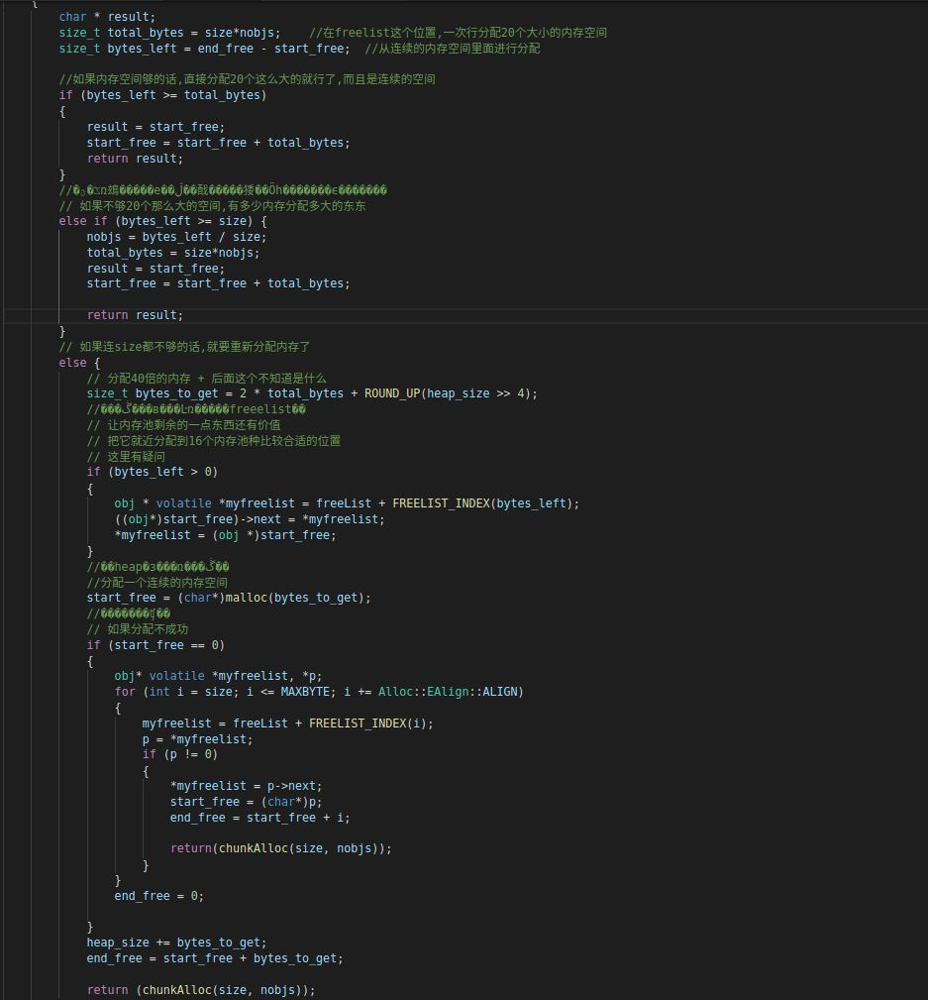

#### 4、deallocate函数

输入释放的内存指针p和内存大小n

（1）如果n大于128，就直接释放

（2）如果小于128，找到对应的index，然后把它插入在freelist对应index的表头，然后由freelist进行管理。

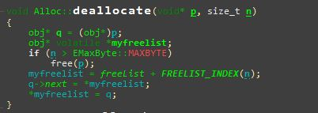

#### 5、obj*的屌屌的用法

​	这种内嵌对象指针的方法广泛的应用在内存管理系统中，每个内存块可以节省一个指针的大小。主要是利用了内存在没有交给用户之前可以不断转换类型来进行管理。

​	前面的freelist中，存放了指向obj的指针，内存分配器分配内存块之后把每个内存的类型都转化为obj*类型，然后里面有一个指向obj的指针，然后用链表串起来。

​	当用户要一个的时候，内存管理器就把这个给从链表中拉下来并且转化为void*类型的数据给用户自己去进行指针类型转化。

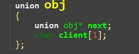

