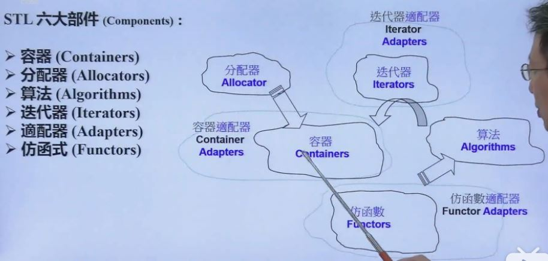
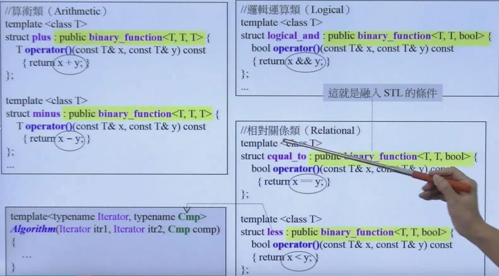
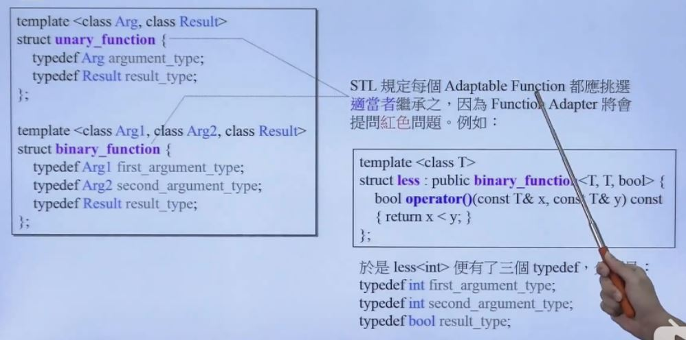

### 一、stl仿函数概述

1、stl仿函数只为stl的algorithm服务。

2、stl仿函数的本质就是设计一个类，然后重载这个类的()操作符，那么当我们使用这个类的对象的()的时候，就会调用()相应的操作。那么从执行的角度上面来说非常类似函数，但它的本质是运行对象的()操作符操作，所以称它为仿函数。

### 二、stl仿函数的分类和继承关系

#### 1、stl仿函数的分类

​	stl仿函数主要可以分为以下几类：算数类，主要是元素算数运算，例如加减乘除、取余、求负数等等；逻辑运算类，主要涉及逻辑运算，例如与或非、异或等等；相对关系类，例如两个元素是否相等，比大小等等。

​	stl仿函数都是构造一个类，然后重载该类的()操作符。最后作为一个模板类型，传入算法模板类型中。算法实际调用的时候，利用这个类声明一个对象，然后调用()去调用相关的操作。

#### 2、仿函数的继承关系

​	当我们设计自己的仿函数的时候，需要根据自己的函数是一元函数还是二元函数（有多少个参数）选择继承unary_function或者是binary_function，这样才能完整地融入到stl里面。（如上图所示）

​	下图是仿函数的可适配条件：

​	

