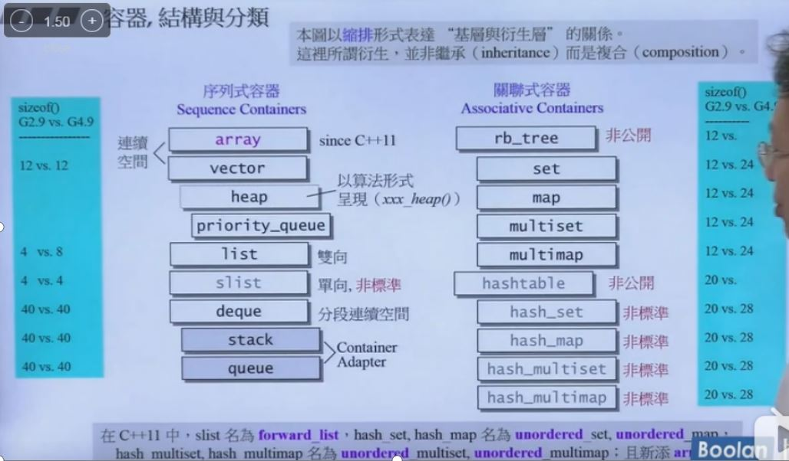

[TOC]

### 一、适配器概述

#### 1、笔记整理原则

（1）尽量画很多图来加深对list数据结构和设计的理解，**一图胜千言**。

（2）不会详细讲解所有的代码，而是讲解**代码中的关键点，关键的数据结构和关键操作，并且对一些关键的边界条件进行讲解。**

（3）只讲解关键点，让你能完全hold住的关键点。

#### 2、适配器简单介绍

（1）适配器是软件设计模式的一种，它的本质就是把一个东西以另外的面貌（接口）展示给客户，但是又不修改这个东西的底层实现。例如适配器A改造了B，那么面对客户的就是A，B被隐藏了起来，用户实际调用的也是A的接口，然后通过A调用B的具体实现。

（2）A要用到B的东西有两种方式，继承或者是组合，stl里面用的都是组合composition

（3）stl的适配器主要分为三种：容器适配器，函数适配器和迭代器适配器。

### 二、各种适配器的例子讲解

#### 1、容器适配器

​	容器适配器就是某种容器底层使用了另外一种容器来完成该容器的操作，例如stl里面的queue、stack底层使用了deque容器；set、map使用了rb_tree；hash_set、hash_map使用了hash_table等等。下图是stl各种容器的使用关系。



​	举例：stack和queue使用了deque


#### 2、函数适配器

​	函数适配器是用来为stl的仿函数服务的，而仿函数是用来为算法服务的，使用函数适配器的话，我们可以在不需要重新写一个函数或者类的情况下，用很少的代码实现一个新的仿函数，已达到新的功能。

​	stl创建的函数适配器主要有bind2nd、bind1st、not1、bind等等。

(1)binder2nd

```
简单讲binder2nd原理
首先 count_if(vi.begin(),vi.end(),bind2nd(less<int>(),40))就是实现计算容器vi中有元素值小于40的个数。
a. bind2nd(less<int>(),40)调用到了binder2nd(less<int>(),40)构造函数，生成一个对象，对象中的op就是less，同时把40保存到value中存起来。
b. 当count_if中的pred对象，也就是binder2nd类型对象，调用了pred(*first)的时候就调用了binder2nd的operator()操作符重载，相当于调用了less(*first,value)。也就是对容器内的元素值和value（40）进行比较。
```


